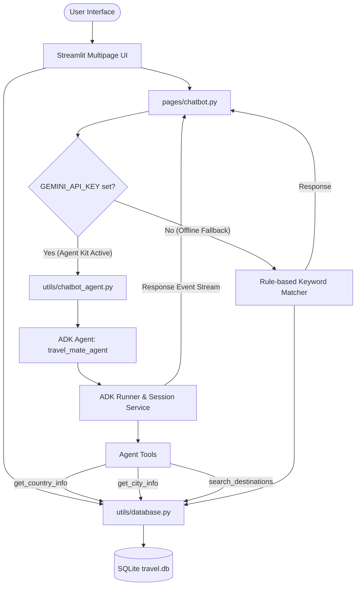

# ✈️ TravelMate AI – Smart Travel Companion

[](https://code.swecha.org/sweety28/travel-information-and-guide)
[](https://github.com/pre-commit/pre-commit)
[](https://www.python.org/)
[](LICENSE)
[](spec.md)

TravelMate AI is a comprehensive, premium Streamlit-based travel companion application designed to help tourists understand countries and cities before visiting. The platform offers critical local regulations, safety instructions, transit rules, cultural dos & don'ts, recommended hotel stays, famous cuisines, and custom-tailored day-by-day travel planners.

---

## 🏗️ System Architecture

The following Mermaid diagram illustrates how components flow inside the application, from the Streamlit views to the SQLite database and the Google Agent Development Kit (ADK) reasoning loop:



---

## 📊 Present Website Data (Supported Destinations)

The platform is pre-seeded with a comprehensive dataset containing **3 countries** and **60 total destinations** (20 cities/neighborhoods per country) stored in a local SQLite database:

### 🇮🇳 India (20 Cities)
* **North India**: Delhi (Capital), Agra (Taj Mahal), Amritsar, Srinagar, Shimla
* **South India**: Hyderabad, Visakhapatnam, Bangalore, Chennai, Kochi, Mysore
* **West India**: Mumbai, Goa, Udaipur, Pune, Ahmedabad
* **East India**: Kolkata, Darjeeling, Varanasi, Jaipur

### 🇯🇵 Japan (20 Cities)
* **Kanto & Kansai**: Tokyo (Capital), Yokohama, Kamakura, Nikko, Osaka, Kyoto, Nara, Kobe, Himeji
* **Chubu & Tohoku**: Nagoya, Takayama, Matsumoto, Sendai
* **Hokkaido (North)**: Sapporo, Hakodate
* **Kyushu & Okinawa (South)**: Fukuoka, Nagasaki, Okinawa
* **Chugoku & Ishikawa**: Hiroshima, Kanazawa

### 🇸🇬 Singapore (20 Neighborhoods & Planning Areas)
* **Central & Downtown**: Downtown Core (Capital), Marina Bay, Orchard Road, Chinatown, Little India, Sentosa Island, Novena, Bukit Timah
* **East Coast & Regional**: Katong & Geylang, Tampines, Bedok, Changi, Serangoon, Ang Mo Kio, Woodlands, Jurong East, Queenstown, Punggol, Clementi, Yishun

---

## 🚀 Key Features

1. **Home Landing Page**:
   - Beautifully styled hero header with custom font styling.
   - Comprehensive **Search bar** to lookup countries, cities, tourist spots, or cuisines with one-click redirects.
   - Dynamic **Destination Selector** for choosing countries and cities.
   - Featured destinations showcase cards.

2. **Country Information Guide**:
   - Country profiles showing capitals, currencies, official languages, and time zones.
   - Highlighted emergency numbers and contact details.
   - Dedicated sections for **Visa and Pre-Departure checklists**, **Important Rules/Laws**, **Cultural Etiquette (Dos and Don'ts)**, and **Safety Tips**.

3. **City Details Explorer**:
   - Deep-dives into tourist attractions, rated out of 5 stars with optimal timing recommendations.
   - Interactive sections for local dishes (vegetarian and non-vegetarian).
   - Accommodation selections categorized into **Budget**, **Mid-range**, and **Luxury** options.
   - Local transit guidelines, airport transfer suggestions, and localized city safety warnings.

4. **Day-by-Day Travel Planner**:
   - Customizable number of days (1-7 days) and budget levels.
   - Generates morning, afternoon, and evening activity timelines.
   - Recommends specific stays fitting the chosen budget.
   - Dynamic localized budget calculator displaying expense breakdowns (Accommodation, Food, Transit, Sightseeing, Shopping).
   - Interactive **Plotly Pie Chart** visualizing the cost allocation.

5. **AI Travel Assistant (Google Agent Kit Integration)**:
   - Conversational chatbot utilizing Streamlit's native chat elements.
   - Powered by the **Google Agent Development Kit (ADK)** for advanced tool-calling and reasoning.
   - If a `GEMINI_API_KEY` is present, the ADK Agent reasons and dynamically invokes tools (`get_country_info`, `get_city_info`, `search_destinations`) to answer queries.
   - If `GEMINI_API_KEY` is missing, the app gracefully degrades to the **Offline Rule-Based Matcher** (matching queries with session states like selected city or country).

---

## 💻 Installation & Running Locally

### 1. Prerequisites
Ensure you have **Python 3.9+** and **uv** (or pip) installed.

### 2. Navigate to the Workspace
```bash
cd "travel-information-and-guide"
```

### 3. Install Dependencies
Install the required packages:
```bash
# Using uv (Recommended)
uv pip install -r requirements.txt

# Or using pip
pip install -r requirements.txt
```

### 4. Configure Environment Variables
Copy `.env.example` to `.env`:
```bash
cp .env.example .env
```
Fill in your `GEMINI_API_KEY` inside `.env` to enable the Agent Kit AI Assistant.

### 5. Seed/Reset the Database
The application automatically checks and initializes the database on startup. To manually seed or reset it, run:
```bash
python -m data.sample_data
```

### 6. Run the Test Suite
Run the spec-style test suite with:
```bash
$env:PYTHONPATH="."; uv run --with pytest --with pytest-spec --with pytest-describe pytest
```

### 7. Launch the Application
Run the Streamlit application:
```bash
streamlit run app.py
```
Open the local URL displayed in the terminal (usually `http://localhost:8501`) in your web browser.

---

## 🛠️ Code Quality & GitLab Compliance Integration

To satisfy GitLab Compliance requirements, this repository has been configured with the following audit tools:

1. **Formatters & Linters**:
   - **Ruff**: Fast Python linter and formatter.
   - **Flake8**: Standard formatting validator (configured in `.flake8`).
   - **Pylint**: Deep code quality analyzer (configured in `pylintrc`).
   - **Pyupgrade**: Automatically upgrades syntax for newer Python versions.

2. **Type Checking & Quality**:
   - **Mypy**: Optional static typing validator.
   - **Vulture**: Dead code scanner (configured in `pyproject.toml`).

3. **Security Auditing**:
   - **Bandit**: Code security scanner (configured in `pyproject.toml`).
   - **Gitleaks**: Prevents keys and secrets from being committed.
   - **Pip-Audit**: Checks dependencies for known vulnerabilities.

4. **Changelog Automation**:
   - **Git-Cliff**: Automatically generates standard changelogs from conventional commits (configured in `cliff.toml`).

### Local Quality Validation
You can run all quality checks locally before pushing using `pre-commit`:
```bash
pip install pre-commit
pre-commit install
pre-commit run --all-files
```

---

## 📌 GitLab Compliance Resolutions

To clear the remaining GitLab Compliance warnings:
- **❌ Description**: Go to your GitLab Project page, navigate to **Settings -> General**, and write a description under the "Project description" field.
- **❌ Git Tags**: Create and push a git tag to trigger tags validation:
  ```bash
  git tag -a v1.0.0 -m "Release v1.0.0"
  git push origin v1.0.0
  ```
