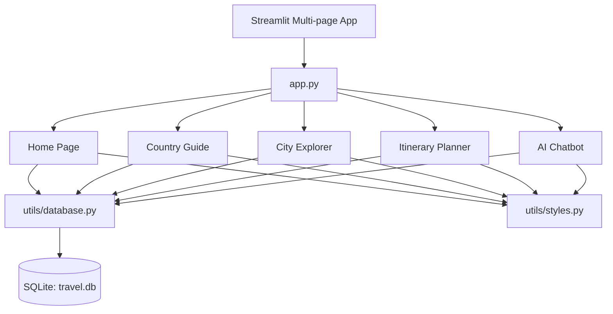

# TravelMate AI – Architecture Documentation

This document describes the high-level system design, folder structure, database schema, and data flows of the **TravelMate AI** application.

---

## 🏗️ System Overview

TravelMate AI is structured as a **modular multi-page Streamlit application** integrated with a **local SQLite database**.



- **Frontend**: Streamlit dynamic pages (`pages/*.py`) styled with customized CSS injections (`utils/styles.py`).
- **Backend / Data Layer**: SQLite database containing country rules, itineraries, local recommendations, and transport data.
- **AI Engine**: A local rule-based/context-aware query parser and conversational database agent (`pages/chatbot.py`).

---

## 📂 Codebase Structure

```text
├── app.py                     # Main router, configures pages and handles sidebar setup
├── database/
│   └── travel.db              # SQLite binary database populated with travel datasets
├── data/
│   └── sample_data.py         # Seed dataset definition and script to pop database
├── pages/
│   ├── home.py                # Landpage hero view, featured spots, search bar
│   ├── country_info.py        # Visa, checklists, rules, etiquette & safety
│   ├── city_info.py           # Local transit, dining, hotels, and attractions
│   ├── planner.py             # Customizable day-by-day itinerator & cost calculator
│   └── chatbot.py             # Context-aware local chatbot utilizing sqlite database
├── utils/
│   ├── database.py            # database connection pool & SQL query functions
│   └── styles.py              # Custom global and page-specific stylesheet rules
├── tests/
│   └── test_database_spec.py  # Unit test suite verifying search and DB connection
├── requirements.txt           # Python dependency manifests
└── pytest.ini                 # Pytest configuration flags
```

---

## 🗄️ Database Schema

The SQLite database (`database/travel.db`) consists of two main tables with a one-to-many relationship:

### 1. `countries` Table
Stores high-level profiles for entire nations.

| Column | Type | Description |
| :--- | :--- | :--- |
| `id` | `INTEGER` | Primary Key, Auto-incremented |
| `country_name` | `TEXT` | Unique name of the country |
| `capital` | `TEXT` | Capital city name |
| `currency` | `TEXT` | Local currency symbol / name |
| `language` | `TEXT` | Primary official language(s) |
| `timezone` | `TEXT` | Time zone notation |
| `emergency_number` | `TEXT` | Essential local emergency contacts |
| `visa_info` | `TEXT` | Visa requirements / link |
| `rules` | `TEXT` | Crucial laws or warnings |
| `etiquette` | `TEXT` | Cultural dos & don'ts |
| `safety_tips` | `TEXT` | General safety advice |

### 2. `cities` Table
Stores city-specific profiles, activities, and local guides.

| Column | Type | Description |
| :--- | :--- | :--- |
| `id` | `INTEGER` | Primary Key, Auto-incremented |
| `country_id` | `INTEGER` | Foreign Key referencing `countries(id)` |
| `city_name` | `TEXT` | Name of the city |
| `description` | `TEXT` | Overview of the city |
| `transport_info` | `TEXT` | Local buses, trains, metros |
| `food_info` | `TEXT` | Traditional cuisines |
| `tourist_places` | `TEXT` | JSON string storing list of places, ratings, details |
| `hotel_info` | `TEXT` | JSON string storing stays classified into budget/luxury tiers |
| `shopping_areas` | `TEXT` | Local traditional markets and malls |
| `airport_details` | `TEXT` | Airport transfer rules and details |
| `safety_recommendations`| `TEXT` | Neighborhood safety details |

---

## 💬 Context-Aware Chatbot Mechanism
The **AI Travel Assistant** uses Streamlit session states (`st.session_state`) to maintain conversational state and context:
1. **Context Memory**: Tracks the user's active country or city (selected on other pages).
2. **Local SQL Search**: If a user asks a query (e.g. *"What food should I try?"*), the assistant checks if there is an active city in the session. If yes, it queries the `food_info` column for that city.
3. **Keyword Matching**: Employs keywords to trigger SQL functions like `search_locations()` to return dynamic safety rules, hotel listings, or transit options.
